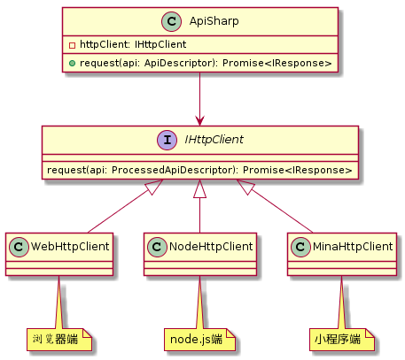

<h1 align="center">Api Sharp</h1>

<div align="center">
api-sharp 是一个声明式、可扩展、跨平台的 JavaScript 网络请求库。

<p>

[](https://www.npmjs.com/package/api-sharp)   [](https://circleci.com/dashboard)

</p>

</div>

## 特性

- 简单
- 声明式
- 配置丰富
  - 请求基地址
  - 请求地址
  - 请求方法
  - 请求 HTTP 头
  - 接口描述
  - 超时设置
  - 请求参数校验
  - 请求参数转换
  - 响应数据转换
  - 缓存
  - 数据 mock
  - 失败重试
  - 自定义日志
  - ...
- 包含 TS 类型定义

## 安装

通过 npm 安装（或者 yarn）

```bash
$ npm install api-sharp
```

## 示例

创建 ApiSharp 实例

```js
import {ApiSharp} from "api-sharp"

// 创建实例，可以传入全局配置，省略使用默认配置
const apiSharp = new ApiSharp({...})
```

发送 GET 请求

```js
const response = await apiSharp.request({ url: "/json/server_date" })
```

发送 POST 请求

```js
const response = await apiSharp.request({
  url: "/json/server_date",
  method: "POST",
  params: {
    format: "json"
  }
})
```

开启缓存（仅支持 GET 请求）

```js
const apiDescriptor = {
  url: "/json/server_date",
  enableCache: true,
  cacheTime: 10 * 1000
}
const response1 = await apiSharp.request(apiDescriptor)
const response2 = await apiSharp.request(apiDescriptor)
expect(response1.from).toEqual("network")
expect(response2.from).toEqual("cache")
expect(response1.data).toEqual(response2.data)
```

开启参数类型校验

```js
// 引入 prop-types
import PropTypes from "prop-types"

const response = await apiSharp.request({
  url: "/json/server_date",
  paramsType: {
    name: PropTypes.string.isRequired
  },
  params: {
    name: "jim"
  }
})
// 如果参数 name 省略或者不是 string 类型，控制台打印错误提示，但不会阻止请求发出
```

开启接口数据 mock

```js
const response = await apiSharp.request({
  url: "/json/server_date",
  enableMock: true,
  mockData: "mock data"
})
expect(response.data).toEqual("mock data")
```

开启失败重试

```js
const response = await apiSharp.request({
  url: "/json/server_date",
  enableRetry: true,
  retryTimes: 3
})
```

在线示例

[](https://codesandbox.io/s/api-sharp-demo-rw1n3?expanddevtools=1&fontsize=14&module=%2Fsrc%2Findex.js)

## 文档

### API

```typescript
class ApiSharp {
  // 请求数据
  request(url: string): Promise<IResponse>
  request(api: ApiDescriptor): Promise<IResponse>
}
```

**ApiDescriptor** 的 TS 定义：

```typescript
export interface ApiDescriptor {
  /**
   * 请求的 HTTP 地址，支持相对地址和绝对地址
   * 如果是相对地址时，以 baseURL 作为基地址，计算最终地址
   * 如果是绝对地址，则忽略 baseURL，以该地址作为最终地址
   */
  url: string
  /**
   * 基地址
   */
  baseURL?: string
  /**
   * HTTP 请求方法，默认为 GET 方法
   */
  method?: HttpMethod
  /**
   * HTTP 请求头
   */
  headers?: HttpHeader
  /**
   * 接口描述
   */
  description?: string | ReturnTypeFn<string>
  /**
   * 请求参数
   * GET 请求时，对象的键值对编码后作为 URL 后的查询字符串
   * POST 请求时，对象转换为 JSON 格式后作为 HTTP 的 body
   */
  params?: Params
  /**
   * 请求参数类型
   * 对请求参数 params 进行类型校验并打印警告，仅在 process.env.NODE_ENV !== 'production' 时生效，生产环境不会增加额外的包体积大小
   */
  paramsType?: ParamsType
  /**
   * 请求参数转换函数
   * 用户发起调用 -> params(原始参数) -> transformRequest(参数转换) -> paramsType(类型校验) -> 发出 HTTP 请求
   */
  transformRequest?: Transformer<Params>
  /**
   * 返回数据转换函数
   * 接收 HTTP 响应 -> returns(返回数据) -> transformResponse(数据转换) -> 用户接收结果
   */
  transformResponse?: Transformer<any>
  /**
   * 开启缓存，默认关闭
   * 并发请求相同接口且参数相同时，实际只会发出一个请求，因为缓存的是请求的 Promise。
   */
  enableCache?: boolean | ReturnTypeFn<boolean>
  /**
   * 缓存持续时间(单位毫秒)，默认 5 分钟
   * 下次取缓存时，如果缓存已存在的的时间超过该值，则对应缓存失效
   */
  cacheTime?: number | ReturnTypeFn<number>
  /**
   * 开启数据模拟，默认关闭
   */
  enableMock?: boolean | ReturnTypeFn<boolean>
  /**
   * 模拟接口返回的数据，默认 undefined
   */
  mockData?: any | ReturnTypeFn<any>
  /**
   * 开启失败重试，默认关闭
   */
  enableRetry?: boolean | ReturnTypeFn<boolean>
  /**
   * 重试最大次数，默认 1 次
   */
  retryTimes?: number | ReturnTypeFn<number>
  /**
   * 接口超时时间，单位毫秒，默认 60*1000 ms
   * 从发出请求起，如果 timeout 毫秒后接口未返回，接口调用失败。
   */
  timeout?: number
  /**
   * 开启打印日志，默认为 process.env.NODE_ENV !== "production"
   */
  enableLog?: boolean | ReturnTypeFn<boolean>
  /**
   * 日志格式化
   */
  logFormatter?: LogFormatter

  /**
   * 其他用户自定义信息
   * 这些信息会被保留下来
   */
  [name: string]: any
}
```

**IResponse** 的 TS 定义：

```typescript
export interface IResponse<T = any> {
  // HTTP 响应状态码
  status: number
  // HTTP 响应状态描述
  statusText: string
  // HTTP 响应数据
  data: T
  // HTTP 响应头
  headers: HttpHeader
  // 本次请求响应数据的来源
  from: "network" | "cache" | "mock"
  // 本次请求的接口描述符
  api: ProcessedApiDescriptor
}
```

## 更新日志

[CHANGELOG](./CHANGELOG.md)

## 架构

api-sharp 主要针对 Web 浏览器，不过它被设计成平台无关的，通过适配器可以很方便的支持新平台。下面是它的架构图，对上层提供配置项以支持声明式、可扩展的行为，对下层提供适配器以适应不同平台，内部专注于负责实现那些可跨平台通用的额的网络请求逻辑，如缓存、重试、mock 等。


ApiSharp 内部有一个`IHttpClient`的请求接口，通过不同的具体实现完成对各个平台的适配。



## 参与共建

克隆项目后，切换到项目根目录下，并安装依赖

```bash
$ git clone <path_to_project>
$ cd <path_to_project>
$ npm install
```

下面两条指令分别启动 node API 服务和 jest 测试

```bash
$ npm run server
$ npm run test:watch
```

执行后便可以在`src`目录下修改源码，在`test`目录编写测试用例进行测试

项目目录结构如下：

```
docs                // 文档
src                 // 源码
  |--cache          // 缓存实现
  |--http_client    // HTTP请求实现
  |--types          // 内部类型定义
test
  |--api_sharp      // 单元测试
  |--server         // 接口测试服务
types               // 全局类型定义
babel.config.js     // babel 配置
package.json        // 包配置
tsconfig.json       // TS 编译配置

```

## LICENSE

[MIT](./LICENSE)
